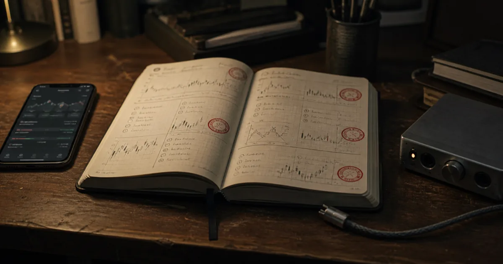

> **모의투자부터 시작한 주식 앱 제작기 1**<br>
> 현재 단계: 해외주식 읽기 전용 수집 · 모의계좌 · 보수적 가상체결 · 모바일 조회 화면<br>
> 실제 주문 경로는 없으며, 이 글은 특정 종목이나 투자 방법을 권하지 않는다.



주식 앱이라면 보통 오늘 살 종목부터 보여 줘야 할 것 같다. 그런데 내가 만든
앱에서 먼저 남기기로 한 것은 **매수하지 않은 이유**였다. 가격이 올라도
스프레드가 넓으면 제외하고, 조건이 좋아 보여도 남은 상승 여력보다 손절 거리와
비용이 크면 막는다. 데이터가 오래됐거나 호가가 이상하면 빈칸을 추측으로 채우지
않고 그 판단 자체를 중단한다.

현재 이 앱에는 실제 주식을 주문하는 기능이 없다. 일부러 계좌 조회와 주문 API
경로를 만들지 않았다. 그렇다면 수익을 바로 낼 수도 없는 앱을 왜 만들었을까?
답은 단순하다. **그럴듯한 종목 추천과 반복 가능한 투자 판단은 서로 다른
문제**였기 때문이다.

## 수익률보다 먼저 검증하고 싶었던 것

전신 프로젝트에서 여러 전략을 돌리며 가장 크게 배운 것은 승률이 높다고 좋은
전략이 되지는 않는다는 점이었다. 신호를 충분히 확인한 뒤 들어가면 맞을 확률은
높아질 수 있지만, 이미 가격이 움직여 남은 폭은 작아진다. 거래가 잦아질수록
수수료와 스프레드도 쌓인다. 과거 결과가 마음에 들지 않을 때마다 조건을 바꾸고
표본을 새로 시작하면 실패한 기록은 사라지고, 마지막에 살아남은 숫자만 좋아
보이기 쉽다.

그래서 새 프로젝트 `edgelab`의 목표를 “수익률이 높은 전략을 만드는 것”으로
두지 않았다. 현재 목표는 **비용을 뺀 전향적 모의표본으로 어떤 규칙에 엣지가
있는지 정직하게 판정하는 가장 작은 시스템**을 만드는 것이다. 여기서 전향적
표본은 이미 결말을 아는 과거 차트에 규칙을 맞추는 대신, 그 시점에 알 수 있었던
정보로 먼저 판단을 기록하고 나중에 결과를 붙인다는 뜻이다.

이 차이가 앱의 순서를 완전히 바꿨다.

```text
읽기 전용 시세 수집
  → 후보를 넓게 발견
  → 전략별 조건 판정
  → 수수료·스프레드·슬리피지를 포함한 손익비 계산
  → 계좌 노출·계획손실 한도 확인
  → 호가와 잔량을 반영한 가상체결
  → 진입·차단 이유를 같은 저널에 기록
  → 표본이 쌓인 뒤에만 전략 승격 심사
```

추천 화면은 이 흐름의 시작이 아니라 결과다.

## 첫 번째 안전장치: 실주문으로 가는 길을 없앴다

모의투자 앱이 실전 앱과 비슷하게 보일수록 가장 먼저 확인해야 할 것은 버튼의
모양이 아니라 시스템 경계다. `edgelab`의 공개 응답은 항상
`paperOnly=true`, `actualOrderAllowed=false`를 유지한다. 토스 연결도 종목
마스터, 랭킹, 가격, 호가, 일봉과 같은 읽기 전용 데이터에 한정했다. 실제 계좌,
잔고, 주문 API를 호출하는 코드는 두지 않았다.

이 경계는 나중에 스위치 하나로 해제할 임시 제한이 아니다. 실전 전환이 필요하면
별도 저장소, 별도 승인, 별도 위험 검토를 거치도록 운영 계약에 적었다. 모의투자
결과가 좋아 보인다는 이유만으로 수집 코드가 주문 코드가 되는 일을 구조적으로
막기 위해서다.

| 앱이 하는 일 | 앱이 하지 않는 일 |
|---|---|
| 미국주식 후보와 시세를 읽는다 | 실제 계좌와 잔고를 읽지 않는다 |
| 비용을 포함해 진입 자격을 계산한다 | 수익을 보장하거나 종목을 추천하지 않는다 |
| 가상계좌에서 정수주 체결을 흉내 낸다 | 실제 주문을 전송하지 않는다 |
| 진입과 차단 이유를 모두 기록한다 | 불리한 표본을 지우고 다시 시작하지 않는다 |

## 두 번째 안전장치: 화면 가격을 체결 가격으로 믿지 않았다

모의투자는 단순히 현재가에 매수 기록을 남기면 쉽게 좋아진다. 하지만 실제 매수는
보통 매도호가에서, 매도는 매수호가에서 일어난다. 여기에 수수료와 슬리피지가
붙고, 호가 잔량이 얇으면 원하는 수량을 모두 살 수도 없다.

현재 가상체결기는 매수할 때 매도호가, 매도할 때 매수호가를 기준으로 쓴다.
표시된 최우선 호가 잔량의 10%까지만 체결 가능하다고 가정하고, 미국주식 수량은
정수주로 계산한다. 환율이나 호가가 없거나, 매수호가가 매도호가보다 높은 이상
상태라면 체결하지 않는다. 모의 결과를 예쁘게 만드는 쪽이 아니라 실제보다 조금
불리하게 보는 쪽을 선택했다.

이 규칙을 넣고 나면 “후보를 잘 찾았는가?” 다음에 더 까다로운 질문이 생긴다.
**그 가격과 그 수량으로 정말 살 수 있었는가?** 앱은 이 질문을 통과한 경우만
가상계좌의 포지션으로 기록한다.

## 세 번째 안전장치: 전략보다 공통 관문을 먼저 만들었다

종목 선정 전략이 직접 “얼마나 살지”까지 결정하게 두면 전략마다 자신에게 유리한
계산을 붙이기 쉽다. 그래서 전략은 자리와 무효화 가격만 제출한다. 비용을 포함한
손익비, 자금 배분, 체결, 청산은 모든 전략이 같은 공통 관문을 통과한다.

현재 일간 실험의 두 전략은 각각 200만원 모의계좌를 쓴다. 계좌별 최대 노출은
80%, 동시에 감수하는 계획손실은 8%, 보유 포지션은 최대 5개다. 이미 보유한
종목을 다시 사서 평균단가를 낮추는 방식도 막았다. 후보가 많아도 한도를 넘으면
사지 않는 것이 정상 결과다.

진입 자격의 핵심도 점수가 아니라 손익비 `R`이다.

```text
R = 예상 상방 여력 ÷ (구조 무효화 거리 + 왕복 거래비용)
```

현재 최소 기준은 `R ≥ 2.0`이다. 점수가 높다는 말보다 목표 폭이 손절과 비용에
비해 충분히 남아 있는지를 먼저 본다. 이 계산이 중요한 이유는 이미 많이 오른
종목을 별도 감점표 없이도 걸러낼 수 있기 때문이다. 가격이 지지선에서 멀어질수록
무효화 거리가 커지고, R의 분모가 커져 진입 자격을 잃는다.

## 지금 앱은 어디까지 왔나

기준 커밋 `a1b32b0`에서 핵심 흐름은 실제 코드로 연결돼 있다.

- 토스의 종목 마스터·랭킹·가격·호가·일봉을 읽기 전용으로 수집한다.
- 랭킹 종목과 종목 마스터 순환 표본을 섞어 랭킹 밖 종목도 후보로 본다.
- 개별주 스윙, ETF 신규 정배열, 월간 종합 전략을 서로 다른 모의계좌로 기록한다.
- 수수료·스프레드·슬리피지, 노출·계획손실, 정수주·호가 잔량을 공통 관문으로
  계산한다.
- 구조 무효화, `+1R` 절반 청산, 보유기간 경계로 가상 포지션을 관리한다.
- 판단 시점의 조건과 차단 이유, 파라미터 지문을 SQLite 저널에 계속 남긴다.
- 모바일 화면은 오늘 상태, 이벤트, 전략별 성적, 승격 심사를 읽기 전용으로
  보여 준다.

전체 단위 테스트 178개도 현재 커밋에서 통과했다. 하지만 테스트 통과는 전략이
돈을 번다는 증거가 아니다. 코드가 정한 안전 계약과 계산을 반복해서 지킨다는
증거에 가깝다. 전략의 유효성은 앞으로 종결된 모의체결 표본으로 따로 판정해야
한다.

## 좋은 주식 앱보다 정직한 실험 도구에 가깝다

이 프로젝트를 시작하며 가장 기대한 화면은 높은 수익률 그래프가 아니었다.
“왜 오늘은 아무것도 사지 않았는가”를 한 문장으로 설명하는 화면이었다. 데이터가
부족했는지, 비용을 빼니 손익비가 모자랐는지, 계좌 위험 한도에 걸렸는지를
구분할 수 있어야 다음 수정도 감이 아니라 기록에서 시작할 수 있다.

그래서 현재의 `edgelab`은 완성된 투자 상품보다 **내 판단을 반박하기 위한 실험
장치**에 가깝다. 앞으로 이 연재에서도 성공한 기능만 정리하지 않을 생각이다.
후보를 너무 좁힌 규칙, 모의체결에서 드러난 마찰, 리플레이 뒤 폐기한 알고리즘,
파라미터를 바꾼 이유를 기준 커밋과 함께 남길 예정이다.

다음 편에서는 이 시스템이 시장 전체를 무작정 훑지 않으면서도 랭킹에만 갇히지
않도록 만든 후보 수집 방식을 다룬다. **왜 랭킹 80개와 종목 마스터 순환 120개를
섞고, 그중 개별주 24개와 ETF 20개만 비싼 정밀 수집으로 넘기는가?** 종목 선정
알고리즘보다 먼저 만든 “어디까지 볼 것인가”의 기준부터 공개한다.

---

**다음 글**: 미국주식 후보 수집 알고리즘 — 랭킹 80개와 순환 종목 120개를
섞은 이유 (2026-09-04 예정)

### 프로젝트 근거

- [edgelab 저장소](https://github.com/Seung-Won-Yu/edgelab)
- [운영 계약](https://github.com/Seung-Won-Yu/edgelab/blob/a1b32b0cb9a7bfc58f61c0cbb2d2af8e0a1c148c/docs/OPERATING_CONTRACT.md)
- [전략 판정 코드](https://github.com/Seung-Won-Yu/edgelab/blob/a1b32b0cb9a7bfc58f61c0cbb2d2af8e0a1c148c/edgelab/strategies.py)
- [공통 자금배분 코드](https://github.com/Seung-Won-Yu/edgelab/blob/a1b32b0cb9a7bfc58f61c0cbb2d2af8e0a1c148c/edgelab/portfolio.py)
- [보수적 가상체결 코드](https://github.com/Seung-Won-Yu/edgelab/blob/a1b32b0cb9a7bfc58f61c0cbb2d2af8e0a1c148c/edgelab/execution.py)

> 이 글은 소프트웨어 구현 기록이며 투자 자문이나 종목 추천이 아니다. 모의투자
> 결과는 실제 투자 성과를 보장하지 않는다.
