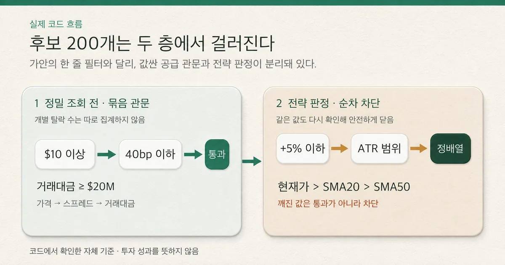
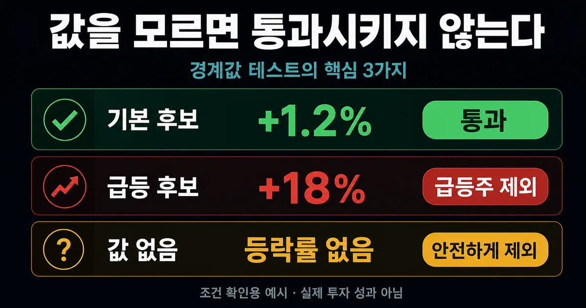

> **모의투자부터 시작한 주식 앱 제작기 2** 
> 이번 질문: 후보 200개를 어떤 순서로 탈락시킬까? 
> 실제 주문 경로는 없으며, 이 글은 특정 종목이나 투자 방법을 권하지 않는다.

## 30초 요약

- 후보를 많이 모으는 일과 실제로 분석할 종목을 고르는 일은 서로 다른 문제였다.
- 먼저 거래하기 어려운 종목을 빼고, 남은 후보에서 급등 여부와 가격 흐름을 다시 확인했다.
- 글에 나온 숫자는 정답이 아니라 현재 앱에서 검증 중인 시험 기준으로 읽어야 한다.

### 먼저 알아둘 말

- **스프레드** — 사려는 가격과 팔려는 가격 사이의 차이다.
- **거래대금** — 하루 동안 그 종목에서 실제로 오간 돈의 규모다.
- **이동평균선** — 최근 일정 기간의 평균 가격을 이어 흐름을 보기 쉽게 만든 선이다.
- **변동 폭** — 가격이 평소 어느 정도 흔들리는지를 나타내는 범위다.
- **결측값** — 수집 실패처럼 이유가 있어 값이 비어 있거나 계산할 수 없는 상태다.

후보 200개를 모으고 나니 더 어려운 문제가 생겼다. 눈에 잘 띄는 종목과 실제로
분석할 만한 종목은 같지 않았다. 가격이 너무 낮거나 거래가 드문 종목을 먼저
빼야 했고, 당일 크게 오른 종목을 무작정 따라가지 않을 기준도 필요했다.

[이전 글 — 좋은 주식은 어떻게 고를까?](https://won0322.tistory.com/213)에서
랭킹 80개와 종목 마스터 순환 120개를 합쳐 후보 200개를 만들었다. 처음에는
이 후보를 `가격 → 유동성 → 스프레드 → 급등 제외 → 정배열`의 한 줄짜리
깔때기에 넣으면 된다고 생각했다.

실제 코드를 다시 따라가 보니 구조는 두 층이었다. 값싼 단계에서 비싼 정밀
조회를 쓸 후보를 줄이는 관문과, 정밀 지표가 준비된 뒤 전략 가설을 판정하는
관문이 따로 있었다.

> **후보 200개에서 급등한 종목과 거래하기 어려운 종목을 어떻게 빼고,
> 남은 후보의 가격 흐름은 언제 확인해야 할까?**

## 실제 구현은 한 줄 필터가 아니라 두 층이다

첫 층은 후보 공급 관문이다. 개별주 후보 규칙(S1)에 정밀 일봉과 호가 분석을 더 쓸
가치가 있는지 판단한다. 코드의 조건식은 보통주인지 확인한 뒤 가격 10달러
이상, 스프레드 40bp 이하, 당일 거래대금 2천만 달러 이상을 함께 요구한다.
이 단계는 매수 신호가 아니라 분석 예산을 배분하는 경계다.

두 번째 층은 전략 판정이다. 정밀 조회에서 현재 가격과 호가, 완결 일봉을
받아 등락률과 SMA20·SMA50를 계산한 뒤 같은 가격·스프레드·거래대금 조건을
다시 확인한다. 이어 당일 +5% 초과 급등, 평소 가격 변동 폭(ATR), 최근
20일·50일 평균 가격의 순서를 본다.

같은 값을 두 번 확인하는 것은 중복처럼 보이지만 공급 단계와 전략 판정
시점의 값이 어긋나거나 깨졌을 때 조용히 통과시키지 않는 안전장치다.

*실제 코드는 가격·스프레드·거래대금을 묶은 공급 관문과 급등·ATR·정배열의
전략 관문을 분리한다. 관문별 탈락 수는 현재 따로 집계하지 않는다.*

## 가격·유동성·스프레드는 같은 질문이 아니다

10달러 가격 하한은 싼 주식이 나쁘다는 선언이 아니다. 현재 S1의 주문 규모와
최소 호가 단위를 고려했을 때 가격이 낮을수록 1센트 차이가 차지하는 비율이
커지는 비용 경계다.

40bp는 `(매도호가-매수호가)/중간가격×10,000`으로 본 상대 스프레드
상한이고, 거래대금 2천만 달러는 하루에 실제로 돈이 얼마나 오갔는지를 보는
별도 유동성 관문이다. [Investor.gov](https://www.investor.gov/introduction-investing/investing-basics/glossary/ask-price)도
bid는 구매자가 지불할 최고가, ask는 판매자가 받을 최저가이며 그 차이가
spread라고 설명한다.

| 단계 | 확인 값 | 현재 코드 기준 | 확인 가능한 증거 |
|---|---|---:|---|
| 후보 공급 | 가격 | $10 이상 | $9.99 경계 테스트 |
| 후보 공급 | 스프레드 | 40bp 이하 | 41bp 경계 테스트 |
| 후보 공급 | 거래대금 | $20M 이상 | $19,999,999 경계 테스트 |
| 전략 판정 | 당일 등락률 | +5% 초과 제외 | +18%·값 없음 차단 테스트 |
| 전략 판정 | 가격 구조 | 현재가>SMA20>SMA50 | 통과 픽스처와 지표 계산 테스트 |

[Amihud의 유동성 연구](https://doi.org/10.1016/S1386-4181(01)00024-6)는
절대수익률을 달러 거래량으로 나눈 값으로 가격 충격을 근사했다. 이 연구가
edgelab의 2천만 달러나 40bp를 정답으로 준 것은 아니다. 다만 거래대금과
스프레드가 서로 다른 유동성 측면을 보여 주며 한 숫자로 대체하면 안 된다는
질문을 제공했다.

## +5%는 좋은 종목을 버리는 규칙이 아니다

급등 제외 관문은 +5%보다 많이 오른 종목이 앞으로 반드시 떨어진다는 예측이
아니다. 후보 수집 단계에는 상승률 랭킹이 들어가므로 이미 주목이 집중된
종목이 자주 섞인다.

[Barber와 Odean의 연구](https://papers.ssrn.com/sol3/papers.cfm?abstract_id=1151595)는
뉴스, 비정상 거래량, 극단적 하루 수익률처럼 눈에 띄는 종목에 개인투자자의
매수가 쏠리는 현상을 확인했다. edgelab은 그 연구의 수치를 복사하지 않고,
급등을 매수 근거로 삼지 않기 위한 자체 경계로 +5%를 둔다.

여기서 예상 밖 결함이 하나 나왔다. 초기 코드는 등락률이 비어 있으면 ‘+5%보다
큰가’를 확인하지 못한 채 관문을 건너뛰었다. 모르는 값이 ‘오르지 않은 값’처럼
취급된 셈이다. 2026-08-26 수정에서는 비어 있는 등락률을 큰 경고값으로 바꿔
급등 관문이 닫히도록 했고, 회귀 테스트로 다시 막았다. 이번 판단이 단순 채택이
아니라 **수정 후 채택**인 이유다.

*전체 경계값은 위 표에 정리했고, 이미지는 일반 독자가 먼저 볼 핵심 세 사례만
요약했다. 기본 후보는 통과하지만 급등 후보와 등락률 값이 없는 후보는 제외된다.*

## 정배열은 미래 수익이 아니라 현재 구조의 이름이다

SMA20과 SMA50는 완결된 일봉 종가로 계산한다. 최소 50개의 완결 봉이 없으면
지표를 만들지 않는다. 현재 가격이 SMA20보다 높고 SMA20이 SMA50보다 높을
때만 S1의 정배열 조건을 만족한다.

이 조건은 지금 가격이 단기·중기 평균 위에 있다는 구조 설명이지 다음 날
상승을 보장하는 예언이 아니다. [Brock·Lakonishok·LeBaron의 원 논문](https://onlinelibrary.wiley.com/doi/abs/10.1111/j.1540-6261.1992.tb04681.x)은
이동평균과 거래범위 규칙을 긴 다우지수 표본에서 검정했다. 그 논문은
이동평균 규칙을 연구할 질문을 제공하지만, SMA20·SMA50 조합이나 개별주
S1의 성과를 대신 증명하지 않는다.

## 현재 서버 기록은 필터 성과표가 아니었다

읽기 전용으로 확인한 모의투자 관찰 기록에는 개별주 규칙(S1)을 통과한 판단
152건 중 142건이 실제 진입으로 이어지지 않은 구간이 있다. 기록은 원인을
호가 깊이, 정수주, 현금 부족 같은 체결 단계의 거부로 분리했다. 따라서 이 수치를
‘필터가 너무 느슨하다’거나 ‘종목이 나쁘다’는 결과로 읽으면 안 된다.

현재 구현에는 가격·스프레드·거래대금 각 관문 전후 후보 수가 따로 없어 그
숫자는 만들지 않았다. 53개 집중 테스트가 통과했어도 테스트는 경계를 지킨다는
증거이지 수익성 증거가 아니다.

## 내 스크리너에 남길 다섯 가지 기준

- 공급 관문과 전략 관문을 분리한다. API 비용과 수익 가설을 한 점수에 섞지
  않는다.
- 가격, 거래대금, 스프레드를 각각 기록한다. 서로 다른 거래 가능성 질문을 한
  값으로 대신하지 않는다.
- 급등률은 추격 위험의 경계로 쓴다. 높은 점수나 상승 예측으로 해석하지 않는다.
- 이동평균은 완결 봉으로 계산한다. 정배열을 현재 구조의 이름으로만 사용한다.
- 결측값은 닫아서 막고 관문별 카운터를 남긴다. 모르는 값을 통과로 해석하지
  않는다.

결론은 수정 후 채택이다. 가격 10달러, 스프레드 40bp, 거래대금 2천만 달러,
당일 +5%, SMA20·SMA50 관문은 현재 S1 입력을 만드는 기준으로 유지한다.
대신 한 줄짜리 순차 필터라는 설명은 버리고, 두 층의 책임과 결측값 차단을
명시한다. 관문별 실제 전후 후보 수를 기록하는 일은 남은 개선 과제다.

다음 질문은 더 많은 종목을 통과시키는 방법이 아니다. **수익보다 먼저 실패
기준을 정해야 하는 이유는 무엇일까?**

> 이 글은 실주문 경로가 없는 미국주식 선정 소프트웨어의 구현 기록이며 투자
> 자문이나 종목 추천이 아니다. 코드·테스트·모의투자 기록은 실제 투자 성과를
> 보장하지 않는다.
