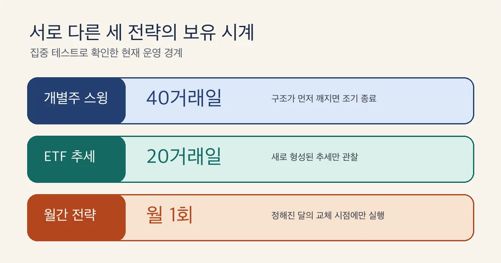

> **모의투자부터 시작한 주식 앱 제작기 4** 
> 이번 질문: 개별주·ETF·월간 전략은 왜 같은 계좌에서 경쟁시키지 않았을까? 
> 실제 주문 경로는 없으며, 이 글은 특정 종목이나 투자 방법을 권하지 않는다.

## 30초 요약

- 주식 전략 분리는 보유기간이 다른 개별주 스윙·상장지수펀드 추세·월간 전략을 한 모의계좌에 섞지 않는 문제였다.
- 개별주 스윙·상장지수펀드 추세·월간 전략에 보유 시계와 전략별 모의계좌를 주는 설계를 채택했다.
- 주식 전략 분리에 쓴 40거래일·20거래일·월 1회는 현재 앱의 운영 경계이며 미래 수익이나 전략의 우열을 뜻하지 않는다.

### 먼저 알아둘 말

- **개별주** — 펀드가 아니라 한 회사의 지분을 나타내는 주식 한 종목이다.
- **상장지수펀드** — 여러 자산을 묶어 거래소에서 주식처럼 사고팔 수 있게 만든 펀드다.
- **스윙** — 하루 안에 끝내지 않고 며칠 이상 가격 흐름을 따라가는 방식이다.
- **리밸런싱** — 정해 둔 주기에 맞춰 보유 종목과 비중을 다시 맞추는 작업이다.
- **모의계좌** — 실제 주문 없이 정해진 체결 규칙과 자금 한도로 성과를 따로 기록하는 시험 장부다.

실패 기준을 정한 뒤에는 모든 전략을 한 계좌에 넣는 편이 공정해 보였다.
같은 돈과 같은 시장에서 겨루면 누가 나은지 빨리 알 수 있을 것 같았다.
하지만 기다리는 시간이 다른 전략이 자본을 다투는 순간 비교 자체가 흐려졌다.

이번에 내린 답은 단순하다. 비용·체결·심사 원칙은 공유하되 신호의 시계와
성과 장부는 전략별로 분리해야 했다.

[이전 글 — 좋은 주식은 어떻게 고를까?](https://won0322.tistory.com/213)에서
후보를 모으는 출발점을 다뤘다면, 이번에는 서로 다른 후보가 왜 별도 전략과
계좌로 가야 했는지 확인한다.

## 같은 계좌가 오히려 불공정했던 이유

한 전략이 며칠 동안 자본을 묶는 동안 다른 전략에 좋은 자리가 와도 살 돈이
없을 수 있다. 이 결과를 전략의 실력이라고 부르면 자본을 먼저 차지한 순서까지
함께 평가하게 된다.

먼저 세 가지를 확인했다.

- 각 전략이 무엇을 고르고 얼마나 기다리는지 적는다.
- 한 전략의 보유가 다른 전략의 자본과 기회를 막는지 확인한다.
- 비용·체결·심사는 공유하고 계좌와 성과 장부는 전략별로 나눈다.

## 세 전략이 보는 시간부터 달랐다

첫 번째 전략은 유동성이 충분한 개별주에서 가격선의 정렬과 눌림을 본다.
현재 구현은 자리가 살아 있으면 최대 40거래일까지 기다리되 구조가 무너지면
먼저 끝낸다.

두 번째 전략은 상장지수펀드(ETF)의 추세가 새로 만들어진 순간을 본다. 이미
오래 이어진 정렬은 새 신호로 보지 않고 최대 보유 경계는 20거래일이다.

세 번째 전략은 하루의 진입 신호가 아니라 월간 포트폴리오다. 과거 여러 달의
흐름과 변동성을 함께 보고 월 1회 종목과 비중을 다시 맞추는 리밸런싱을 한다.

*개별주 스윙은 40거래일, ETF 추세는 20거래일, 월간 전략은 월 1회라는 서로
다른 보유 시계를 구현한다. 비공개 코드는 노출하지 않고 테스트로 확인한 시간
경계만 다시 그렸다.*

## 같은 추세라는 말이 같은 전략은 아니다

세 전략은 모두 과거 가격을 참고하지만 질문이 다르다. 개별주 전략은 한 종목의
현재 구조와 되돌림을 보고, 펀드 전략은 자신의 추세가 막 생겼는지 본다. 월간
전략은 여러 종목의 상대적인 흐름과 흔들림을 함께 순위로 만든다.

[Brock·Lakonishok·LeBaron](https://doi.org/10.1111/j.1540-6261.1992.tb04681.x)은
이동평균 규칙을 오래된 지수 자료에서 시험했다.
[Jegadeesh·Titman](https://doi.org/10.1111/j.1540-6261.1993.tb04702.x)은 과거
3~12개월 성과를 이용한 상대강도 전략을 연구했다.
[Moskowitz·Ooi·Pedersen](https://doi.org/10.1016/j.jfineco.2011.11.003)는 한
자산 자신의 1~12개월 흐름을 보는 시계열 모멘텀을 다뤘다.

이 연구들이 현재 앱의 40일·20일·월 1회를 정해 준 것은 아니다. 서로 다른
신호 정의와 지평이 존재한다는 배경일 뿐이다. 앱의 숫자는 내부 리플레이와
경계 테스트에서 따로 정했다.

## 한 계좌에서 실제로 섞이는 세 가지

- **기회** — 오래 보유한 전략이 현금을 묶으면 다른 전략은 자리가 와도 시험하지 못한다.
- **위험** — 한 전략의 열린 손실과 노출이 다른 전략의 배분 한도를 줄인다.
- **성과** — 같은 장부에 체결이 섞이면 어떤 규칙의 선택이 결과를 만들었는지 설명하기 어렵다.

처음에는 한 계좌가 더 엄격한 경쟁이라고 생각했다. 예상 밖 결과는 반대였다.
보유 시계가 다르면 같은 계좌는 전략 실력뿐 아니라 먼저 자본을 차지한 순서까지
함께 재는 장치가 된다.

[Investor.gov의 ETF 안내](https://www.investor.gov/introduction-investing/general-resources/news-alerts/alerts-bulletins/investor-bulletins-24)는
ETF가 여러 자산을 묶은 펀드이며 거래소에서 장중 시장가격으로 거래된다고
설명한다. [분산투자 안내](https://www.investor.gov/introduction-investing/getting-started/asset-allocation)는
좁은 분야의 ETF가 그 자체로 충분히 분산된 것은 아니라고 덧붙인다.

## 공통층은 남기고 장부만 나눴다

계좌를 분리했다고 모든 것을 복제하지는 않았다. 거래비용 계산, 손익비 관문,
보수적인 모의체결, 실제 주문 금지, 최소 표본과 통계 심사는 같은 공통층을 지난다.

달라지는 것은 자본과 기록의 소유자다. 각 전략은 독립된 모의계좌에서 현금,
보유, 손익을 끝까지 책임진다. 모르는 계좌로 들어온 체결은 추정하지 않고 거절한다.

*한 계좌에서 자본과 성과가 뒤섞이는 구조를 버리고 전략별 계좌로 나눠 같은
기준에서 비교하는 설계를 채택했다. 분리는 성과를 좋게 만드는 장치가 아니라
귀속을 선명하게 만드는 장치다.*

## 테스트가 확인한 것과 아직 모르는 것

| 전략 | 확인한 시계 | 계좌 목적 | 아직 말할 수 없는 것 |
|---|---|---|---|
| 개별주 스윙 | 최대 40거래일 | 개별 종목의 구조 실험 | 미래 수익 |
| ETF 추세 | 최대 20거래일 | 펀드 추세 신호 실험 | 개별주보다 우월한지 |
| 월간 전략 | 월 1회 교체 | 포트폴리오 비중 실험 | 짧은 표본의 우열 |

이번 집중 테스트 99개는 두 일간 전략의 보유 경계, 월간 후보와 비중 계산,
전략별 계좌 라우팅, 공통 심사 연결을 확인했다. 테스트 통과는 설계가 코드에서
유지된다는 증거이지 수익성의 증거가 아니다.

현재 운영 기록도 느린 전략은 같은 거래 건수 기준으로 빨리 판정할 수 없다는
한계를 보여 준다. 특히 월간 전략은 관찰 기회 자체가 적다. 짧은 기간의 숫자로
승자를 선언하지 않는 이유다.

## 내 프로젝트에 옮길 분리 기준 세 줄

- 시계 기준: 신호 주기와 최대 대기 시간이 다르면 실행 상태를 나눈다.
- 자본 기준: 한 규칙의 보유가 다른 규칙의 기회를 막으면 예산과 한도를 나눈다.
- 귀속 기준: 결과를 어느 규칙의 선택으로 설명할지 불명확하면 장부를 나눈다.

판정은 **채택**이다. 개별주·ETF·월간 전략은 같은 비용·체결·심사 원칙을 쓰되
각자 보유 시계와 독립 모의계좌를 유지한다. 계좌 분리는 위험을 없애거나 수익을
보장하지 않지만 비교가 다른 전략의 자본 점유에 오염되는 일은 막는다.

이제 세 전략의 자리는 생겼다. 다음 편에서는 **성과표보다 먼저 왜 삭제하지
않는 판단 기록과 규칙 세대를 만들었는지** 묻는다.

> 이 글은 실주문 경로가 없는 미국주식 모의투자 소프트웨어의 제작 기록이며
> 투자 자문이나 종목 추천이 아니다. 모의투자와 테스트 결과는 실제 투자 성과를
> 보장하지 않는다.
