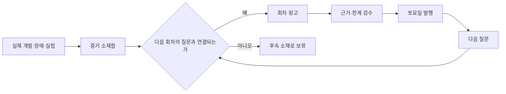

# 모의투자부터 시작한 주식 앱 제작기 — 40편 연재 설계

> 상태: 기준안 v1 — 실제 증거가 부족한 회차는 합치거나 보류
> 제작 주기: 매주 토요일 09:00, 주 1편 · 사용자 최종 확인 뒤 직접 발행
> 기본 분량: 8~12분
> 목표: 40편 본편 + 실제 표본에 따른 후속 운영편

`edgelab`의 실제 구현과 서버 모의투자 결과를 독자가 따라갈 수 있는 순서로
재구성하는 프로젝트 연재다. 개발 커밋 순서를 그대로 옮기지 않는다. 아이디어를
떠올린 이유에서 시작해 기획, 구현, 실패한 실험, 수정, 서버 모의투자, 검증
결과로 이어지는 하나의 이야기로 만든다.

이 연재의 목적은 수익률 자랑이나 종목 추천이 아니다. **어떤 질문에서
출발했고, 무엇을 시험했으며, 어떤 증거 때문에 규칙을 채택하거나 버렸는지**를
남기는 것이 목적이다.

## 연재가 독자에게 하는 약속

- 앞 글의 마지막 질문이 다음 글의 첫 장면이 된다.
- 한 편에는 독자 질문 하나, 실제 증거 하나, 결론 하나만 둔다.
- 실제 코드·테스트·리플레이·모의체결에서 확인한 범위만 쓴다.
- 성공보다 실패, 비용, 차단 이유, 표본 부족을 먼저 공개한다.
- 독자가 다음 편을 읽지 않아도 이번 편에서 하나의 판단 기준을 가져가게 한다.
- 다음 편을 궁금하게 만들되, 결과를 과장하거나 숨겨서 낚지 않는다.
- 실주문 경로가 없고 투자 권유가 아니라는 사실을 모든 편에 명시한다.

## 개발 시간과 이야기 시간을 분리한다

개발은 필요한 기능과 장애를 따라 순서가 바뀔 수 있다. 연재 순서는 바꾸지
않는다. 새 기능이나 실험은 먼저 소재함에 넣고, 이야기상 필요한 차례가 왔을 때
사용한다.



현재 서버가 이미 모의투자를 실행 중이어도 초반 글에서 결과를 한꺼번에
공개하지 않는다. 각 글 끝의 `현재 서버에서는` 상자에 해당 규칙이 실제로
가동 중인지 2~3문장으로만 보여 주고, 전체 성적과 판정은 운영 구간에서 다룬다.

## 한 편의 기승전결

각 원고는 아래 아홉 단계를 기본 골격으로 사용한다. 단계 이름을 그대로 소제목으로
반복하지 않고, 주제에 맞는 자연스러운 문장으로 바꾼다.

1. **기 — 실제 장면:** 내가 겪은 문제나 독자가 알아볼 상황으로 시작한다.
2. **질문:** 이번 글이 끝까지 답할 질문을 한 문장으로 고정한다.
3. **처음 생각:** 처음에는 무엇이 맞다고 생각했는지 밝힌다.
4. **기획 또는 구현:** 그 생각을 어떤 규칙과 코드로 옮겼는지 설명한다.
5. **증거:** 테스트, 리플레이, 모의체결, 로그, 화면 중 하나를 보여 준다.
6. **전 — 예상 밖 결과:** 실패, 비용, 예외 또는 트레이드오프를 숨기지 않는다.
7. **결 — 판단:** 채택·수정·기각 중 하나로 끝낸다.
8. **독자 산출물:** 체크리스트, 판단 기준, 계산식, 재현 절차 중 하나를 남긴다.
9. **다음 질문:** 이번 결론 때문에 새로 생긴 질문 하나만 예고한다.

## 발행 품질 문턱

아래 필수 항목을 모두 만족하지 못하면 회차 번호를 채우려고 발행하지 않는다.
인접 회차와 합치거나 실제 표본이 생길 때까지 `NO_PUBLISH_QUALITY`로 보류한다.

- 제목 앞부분에 독자가 검색하거나 궁금해할 문제가 있다.
- 도입 3문단 안에 실제 동기와 이번 질문이 나온다.
- 원문 요약이 아닌 `edgelab`의 선택·실패·결과가 들어간다.
- 코드, 테스트, 데이터, 앱 화면 중 최소 한 가지 실제 증거가 있다.
- 숫자를 제시하면 표본, 기간, 비용, 알려진 편향을 함께 밝힌다.
- 비공개 저장소나 비공개 커밋 링크를 공개 근거로 사용하지 않는다.
- 공식 문서나 논문 등 독자가 열 수 있는 외부 참고자료를 연결한다.
- AI 이미지는 장식이 아니라 구조나 판단을 설명하는 보조 수단으로 사용한다.
- 실서버 IP, 토큰, 인증값, 내부 접속 정보는 쓰지 않는다.
- 한계, `실주문 경로 없음`, `투자 권유 아님`을 명시한다.
- 마지막 문장이 다음 편의 첫 질문으로 자연스럽게 연결된다.
- `30초 요약` 3개와 쉬운 용어 풀이 3~5개가 있어 처음 온 독자도 바로 시작할 수 있다.
- 도입 260자·본문 문단 200자·표 4열 이하를 지키고, 본문에서 티스토리 제목과
  날짜를 반복하지 않는다.
- 일반 독자 이해도와 공개 화면 가독성이 각각 8.5 이상이 될 때까지 같은 작업
  안에서 수정한다. 낮은 점수 자체를 발행 실패의 최종 상태로 사용하지 않는다.

## 40편 이야기 지도

1편은 2026-08-25에 이미 공개했다. 2편부터는 2026-08-29를 시작으로 토요일
주 1회 발행한다. 금요일 자동화·실험 글과는 별도 초안으로 관리한다. 실제
증거가 부족한 회차는 건너뛰지
않고 보류하며, 뒤 회차를 당겨 이야기 순서를 깨지 않는다.

### 1막 — 왜 이 앱을 만들었는가 (1~5편)

독자는 이 구간에서 앱의 목적, 성공과 실패의 기준, 안전 경계를 이해한다.

| 편 | 예정일 | 독자에게 던질 질문과 가제 | 반드시 보여 줄 증거 | 다음 편으로 넘길 질문 |
|---:|---|---|---|---|
| 1 | 2026-08-25 | 좋은 주식은 어떻게 고를까? 내가 미국주식 선정 알고리즘을 만든 이유 | [공개 글](https://won0322.tistory.com/213), 랭킹 80 + 순환 120, 정밀조회 24 + ETF 20 경계 테스트 | 후보에 들었다고 바로 살 수 있을까? |
| 2 | 2026-08-29 | 주식 선정 알고리즘: 급등한 주식을 왜 탈락시켰을까? | 후보 200개의 가격·유동성·스프레드·당일 +5%·SMA20·SMA50 관문 전후 비교 | 수익보다 먼저 실패 기준을 정해야 하는 이유는 무엇일까? |
| 3 | 2026-09-05 | 수익률보다 먼저 실패 기준을 정한 이유 | 운영 계약의 비용 차감·최소 표본·실주문 금지 | 서로 다른 전략을 같은 계좌에서 비교해도 될까? |
| 4 | 2026-09-12 | 개별주·ETF·월간 전략을 따로 설계한 이유 | S1·S2·S3의 서로 다른 보유기간과 계좌 목적 | 각 전략은 어떤 종목을 먼저 탈락시킬까? |
| 5 | 2026-09-19 | 좋은 전략을 고르기 전에 판단 기록부터 만든 이유 | 삭제하지 않는 저널과 규칙 세대 분리 설계 | 후보 200개에서 무엇을 먼저 버릴까? |

### 2막 — 후보를 모으고 탈락시키는 알고리즘 (6~10편)

넓게 발견한 후보가 가격·유동성·구조 관문을 지나 전략별 입력으로 바뀌는 과정을
따라간다.

| 편 | 예정일 | 독자에게 던질 질문과 가제 | 반드시 보여 줄 증거 | 다음 편으로 넘길 질문 |
|---:|---|---|---|---|
| 6 | 2026-09-26 | 주식 종목 필터링: 후보 200개에서 무엇을 먼저 제외할까? | 가격·거래대금·스프레드 관문 전후 후보 수 | 급등한 종목은 왜 점수가 높아도 빠질까? |
| 7 | 2026-10-03 | 급등주는 좋은 종목일까? 당일 +5%를 제외한 이유 | 랭킹 중복과 관심 종목 편향, 급등 추격 제외 규칙 | 남은 종목의 추세는 어떻게 읽을까? |
| 8 | 2026-10-10 | 이동평균선 정배열만 보면 왜 부족할까? | 가격·SMA20·SMA50·ATR로 만든 S1 후보 사례 | 정배열이 깨지면 어디에서 틀렸다고 인정할까? |
| 9 | 2026-10-17 | ETF 추세매매: 정배열 상태보다 새로 생긴 순간을 보는 이유 | 전일 미정렬→당일 정렬 이벤트와 상태 신호 비교 | 매일 매매하지 않는 월간 전략은 무엇이 다를까? |
| 10 | 2026-10-24 | 월간 주식 선정: 모멘텀과 저변동성을 함께 보는 이유 | 12개월·6개월 모멘텀, 최근 1개월 제외, 변동성 점수 | 좋은 후보가 여러 개면 돈을 어떻게 나눌까? |

### 3막 — 모의투자를 실제 체결처럼 만들기 (11~17편)

후보 선정 이후의 비용, 손익비, 자금배분, 체결, 청산을 한 단계씩 다룬다.

| 편 | 예정일 | 독자에게 던질 질문과 가제 | 반드시 보여 줄 증거 | 다음 편으로 넘길 질문 |
|---:|---|---|---|---|
| 11 | 2026-10-31 | 수수료보다 스프레드가 더 무서울 수 있는 이유 | 수수료·스프레드·슬리피지 왕복비용 계산 사례 | 비용을 빼고도 살 가치가 있는지는 어떻게 판단할까? |
| 12 | 2026-11-07 | 승률이 높아도 잃을 수 있다: 손익비 R을 먼저 보는 이유 | 승률과 손익비 조합별 기대값, R≥2 관문 | 좋은 후보가 겹치면 계좌는 얼마씩 배정할까? |
| 13 | 2026-11-14 | 주식 자금배분: 200만원 계좌의 노출과 손실 한도 | 전략별 독립 계좌·노출 80%·계획손실 한도 | 한 주 단위 매수에서는 어떤 마찰이 생길까? |
| 14 | 2026-11-21 | 미국주식 정수주만 살 때 생기는 배분 오차 | 내림 기본·다음 1주 초과 5% 이내 올림 사례 | 화면 가격대로 정말 체결됐다고 볼 수 있을까? |
| 15 | 2026-11-28 | 모의체결은 왜 어렵나: 매수호가·매도호가·잔량 10% | 같은 종목의 화면가와 보수적 가상체결가 비교 | 정규장 밖에서는 같은 규칙을 써도 될까? |
| 16 | 2026-12-05 | 프리마켓에서는 왜 절반만 진입할까? | 세션별 스프레드 표본과 확장장 절반 배분 | 산 뒤에는 무엇을 기준으로 팔까? |
| 17 | 2026-12-12 | 주식 매도 알고리즘: +1R 절반 청산과 구조 무효화선 | 손절·부분익절·시간청산의 실제 상태 전이 | 이 청산 규칙은 과거 데이터에서도 살아남았을까? |

### 4막 — 잘될 것 같던 전략이 실패한 순간 (18~25편)

연재의 전환점이다. 좋은 결과만 고르지 않고, 실패한 가설이 어떤 실험으로
수정되거나 기각됐는지 보여 준다.

| 편 | 예정일 | 독자에게 던질 질문과 가제 | 반드시 보여 줄 증거 | 다음 편으로 넘길 질문 |
|---:|---|---|---|---|
| 18 | 2026-12-19 | 백테스트 데이터 290만 봉을 모으면 충분할까? | 1,402심볼·2016~2026 리플레이 구축과 비용 가정 | 데이터가 많아도 어떤 편향은 남을까? |
| 19 | 2026-12-26 | 백테스트 수익률을 그대로 믿으면 안 되는 이유 | 생존편향·상폐 처리·체결 근사의 방향 | 기존 S1 청산 규칙은 실제로 어떤 결과였을까? |
| 20 | 2027-01-02 | 정배열 전략이 6만 건에서 손실 난 이유 | S1 기존 청산의 승률·평균수익·청산 사유 | 손절선을 조금 늦추면 달라질까? |
| 21 | 2027-01-09 | 손절선을 SMA20 아래 ATR만큼 내린 실험 | k=0·0.5·1.0·1.5 통제 스윕과 채택 결과 | ETF 전략도 같은 처방으로 살아날까? |
| 22 | 2027-01-16 | ETF 신호가 매일 뜨면 신호가 아닌 이유 | S2 상태 신호 실패와 신규 형성 이벤트 재설계 | 레버리지를 쓰면 약한 수익을 키울 수 있을까? |
| 23 | 2027-01-23 | SOXL·SOXS를 검증하고 제외한 이유 | 36개 레버리지 변형의 비용 차감 결과 | 거래량 폭증은 방향을 먼저 알려 줄까? |
| 24 | 2027-01-30 | 거래량이 10배 늘면 다음 날 급등할까? 9만 건 실험 | 3·5·10배 거래량 신호와 체결률·순수익 | 재무정보를 넣으면 지뢰 종목을 피할 수 있을까? |
| 25 | 2027-02-06 | SEC 재무점수를 넣었는데 성과가 나빠진 이유 | EDGAR point-in-time A/B와 위험 플래그 용도 전환 | 실패한 실험과 바뀐 규칙을 어떻게 분리해 기록할까? |

### 5막 — 전략을 믿지 않기 위한 검증 장치 (26~30편)

과거 성과와 전향적 모의투자를 분리하고, 표본과 다중검정으로 승격 여부를
판정하는 과정을 설명한다.

| 편 | 예정일 | 독자에게 던질 질문과 가제 | 반드시 보여 줄 증거 | 다음 편으로 넘길 질문 |
|---:|---|---|---|---|
| 26 | 2027-02-13 | 규칙을 바꾸면 과거 성적도 다시 시작해야 할까? | 불변 저널과 `param_hash` 세대 분리 | 30분 수익과 실제 거래 성과는 같은 표본일까? |
| 27 | 2027-02-20 | 30·60·390분 수익률과 진짜 거래 성과를 나눈 이유 | 캘리브레이션 outcome과 종결 episode 비교 | 몇 건이 쌓여야 전략을 평가할 수 있을까? |
| 28 | 2027-02-27 | 왜 최소 30건 전에는 승자를 정하지 않을까? | 표본 부족 상태의 심사표와 완료 거래 기준 | 여러 전략 중 최고 하나를 고르면 어떤 착시가 생길까? |
| 29 | 2027-03-06 | 전략을 많이 시험할수록 가짜 승자가 생기는 이유 | Šidák 문턱과 무엣지 최고 t값 예시 | 백테스트는 좋지만 편향이 큰 전략은 어떻게 다룰까? |
| 30 | 2027-03-13 | 저가주 전략을 백테스트만으로 채택하지 않은 이유 | S4 생존편향 유보와 전방 30건 조건 | 이 검증을 매일 돌리는 서버는 어떻게 구성했을까? |

### 6막 — 24시간 서버와 읽기 전용 앱 (31~36편)

검증 규칙이 실제 서버에서 계속 실행되고, 사용자는 읽기 전용 앱으로만 관찰하는
구조를 다룬다.

| 편 | 예정일 | 독자에게 던질 질문과 가제 | 반드시 보여 줄 증거 | 다음 편으로 넘길 질문 |
|---:|---|---|---|---|
| 31 | 2027-03-20 | 주식 수집기를 30초마다 돌리면 무슨 일이 생길까? | 발견→정밀조회→판단→저널 단일 쓰기 흐름 | 시세가 오래되거나 환율이 없으면 무엇을 해야 할까? |
| 32 | 2027-03-27 | 시세가 90초 오래되면 거래를 막는 이유 | 가격·환율·미국장 캘린더 fail-closed 사례 | 이 수집기를 개인 서버에 어떻게 올렸을까? |
| 33 | 2027-04-03 | Oracle 서버에서 모의투자를 24시간 돌린 과정 | 단일 프로세스·재시작·월간 타이머 구성 | 자동화는 돌아가는데 백업은 정말 남고 있을까? |
| 34 | 2027-04-10 | 백업이 조용히 빈 파일을 만들었던 이유 | 빈 스냅샷 장애와 이중 차단 검증 | 서버 결과를 휴대폰에 안전하게 보여 주려면? |
| 35 | 2027-04-17 | 실주문 기능이 없는 읽기 전용 주식 API | `paperOnly` 응답·기기 토큰·로그인 제한 | 많은 숫자 중 앱 첫 화면에는 무엇만 남길까? |
| 36 | 2027-04-24 | 주식 앱 첫 화면에 수익률보다 판단 근거를 둔 이유 | 오늘·전략·기록 3탭과 자산·종목 차트 | 실제로 일주일 내버려 두면 시스템은 어떻게 움직일까? |

### 7막 — 서버 모의투자의 결론은 아직 열려 있다 (37~40편)

이 구간의 원고는 미리 결론을 쓰지 않는다. 해당 시점까지 쌓인 실제 서버 DB,
종결된 모의체결, 장애 기록을 기준으로 작성한다.

| 편 | 예정일 | 독자에게 던질 질문과 가제 | 발행 조건 | 다음 편으로 넘길 질문 |
|---:|---|---|---|---|
| 37 | 2027-05-01 | 서버 모의투자 첫 주, 예상과 달랐던 것은 무엇일까? | 7일 연속 관찰 로그와 장애·차단 사유 확보 | 월간 전략의 첫 종목은 어떤 규칙으로 정해졌을까? |
| 38 | 2027-05-08 | 첫 월간 포트폴리오는 어떻게 구성됐을까? | 실제 S3 리밸런싱 기록과 제외 사유 확보 | 단기 전략은 최소 표본을 채웠을까? |
| 39 | 2027-05-15 | 모의체결 30건 뒤 살아남은 전략은 있었을까? | 같은 `param_hash`의 종결 거래 30건 이상 | 처음 기획과 현재 앱은 얼마나 달라졌을까? |
| 40 | 2027-05-22 | 9개월 주식 앱 제작기: 무엇을 만들고 무엇을 버렸나 | 전체 변경·기각·장애·표본 회고 가능 | 시즌 2에서 검증할 질문은 무엇일까? |

## 운영 결과로 연장을 결정하는 규칙

40편을 채우는 것이 목표가 아니다. 실제 데이터가 생기면 다음 주제를 같은 품질
문턱으로 추가할 수 있다.

- 전략별 첫 청산과 예상 밖 결과
- 같은 전략의 정규장·비정규장 비교
- 월간 리밸런싱 2회·3회 누적 비교
- 표본 30건에서 기각된 전략의 원인 분석
- 파라미터를 바꾸지 않고 관찰한 한 달·세 달 회고
- 독자 검색어와 댓글에서 반복된 질문의 재현 실험

성과가 아직 없거나 표본이 부족하면 `결과 공개`를 가장하지 않는다. `현재까지
결론 불가`도 유효한 결론이며, 무엇이 더 쌓여야 판단 가능한지 설명한다.

## 회차 제작 카드

새 원고를 쓰기 전에 아래 카드를 먼저 채운다.

```text
회차 / 이야기 위치:
독자 질문:
첫 장면:
처음 가설:
실제 구현 또는 실험:
증거 파일·테스트·데이터:
예상 밖 결과:
채택·수정·기각:
독자가 가져갈 산출물:
공개 참고자료:
공개하면 안 되는 정보:
현재 서버에서는:
다음 편 질문:
```

## 현재 공개 글과 다음 작업

- [1편 후보 수집 원고](01-stock-selection-algorithm.md)는 2026-08-25에
  [티스토리 공개](https://won0322.tistory.com/213)까지 완료했다. 다시 생성하거나
  미래 예약본으로 올리지 않는다.
- 2편은 1편 마지막 문장의 질문을 그대로 이어받아 후보 200개를
  `가격 → 유동성 → 스프레드 → 급등 제외 → 정배열` 순서로 탈락시키는 실제
  코드와 테스트에 집중한다.
- 2026-08-29 토요일 18:00의 2편부터 매주 토요일 같은 흐름으로 이어간다.

## 공개 근거와 보안 원칙

- 비공개 `edgelab` 저장소 링크와 비공개 커밋은 글에 걸지 않는다.
- 구현 근거는 글 안에서 필요한 만큼 재구성하고, 독자가 확인할 수 있는 공식
  문서·논문을 참고자료로 연결한다.
- 서버 IP, SSH 경로, 토큰, 쿠키, 내부 인증값, 실제 접속 주소는 이미지에도
  노출하지 않는다.
- 앱 화면은 계좌·토큰·서버 주소를 가린 뒤 사용한다.
- 모의투자 결과는 비용과 표본을 함께 표시하고 실제 수익을 암시하지 않는다.
